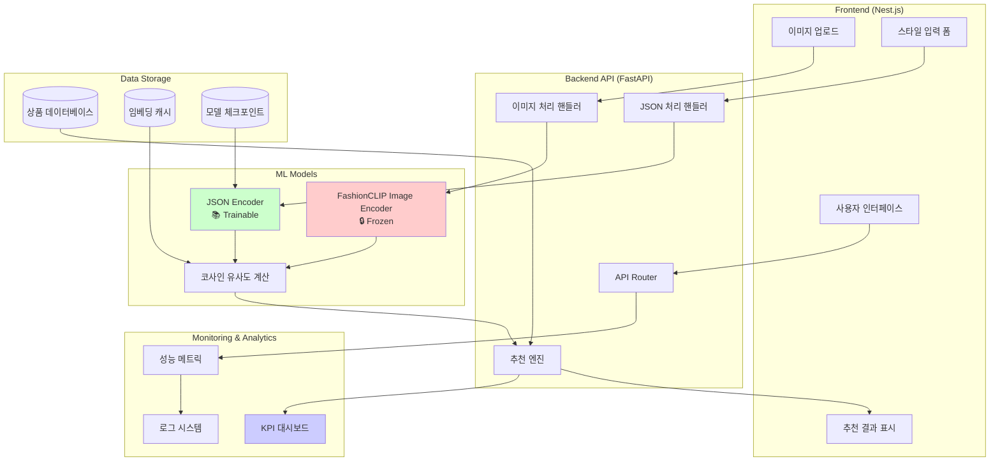
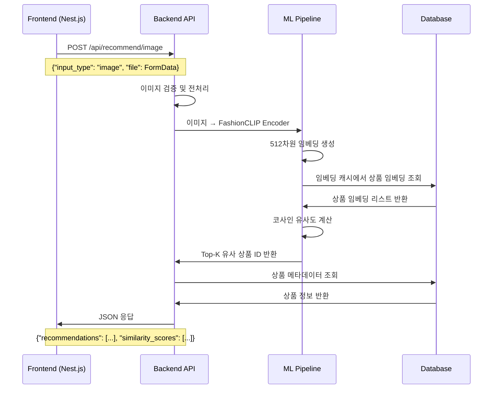
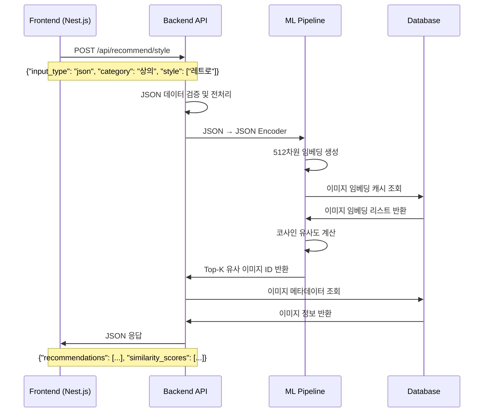
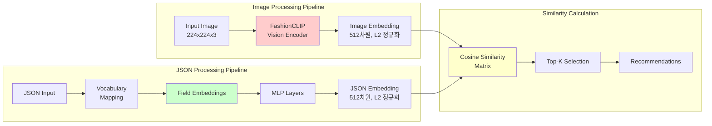
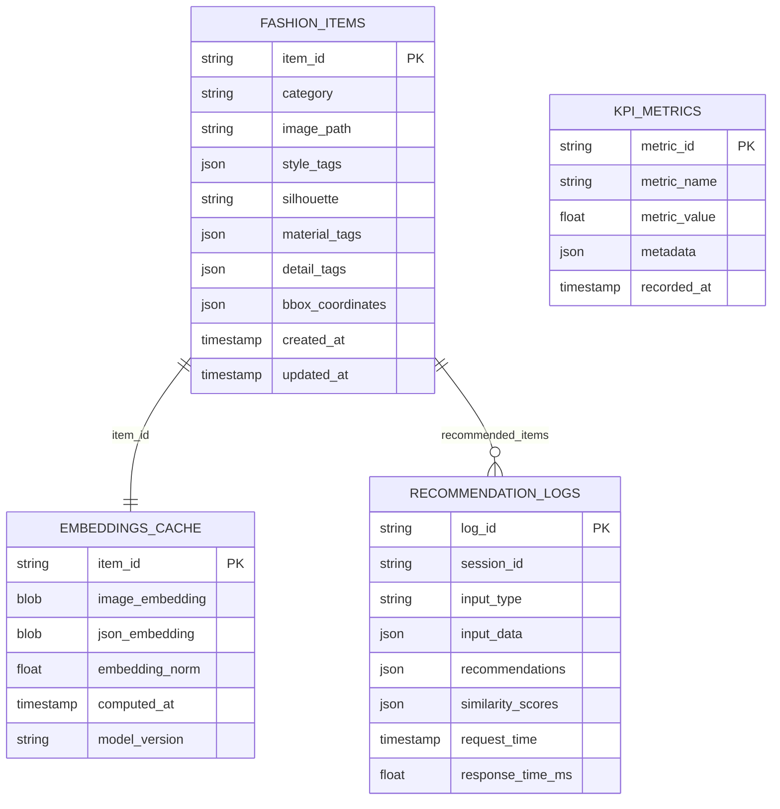
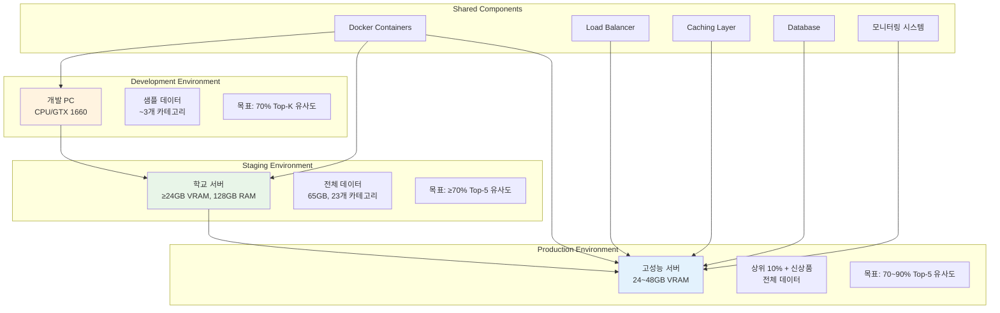
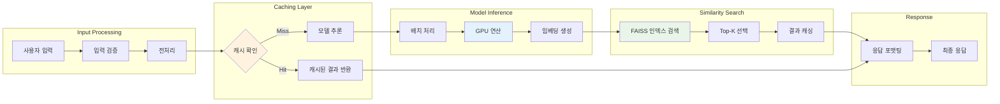

# Fashion JSON Encoder - 시스템 아키텍처 및 데이터 흐름

## 전체 시스템 아키텍처



## 프론트엔드 ↔ 백엔드 ↔ FastAPI 데이터 흐름

### 1. 이미지 기반 추천 흐름



### 2. JSON 스타일 기반 추천 흐름



## 상세 컴포넌트 아키텍처

### ML Pipeline 내부 구조



### JSON Encoder 상세 구조

```mermaid
graph TB
    subgraph "Input JSON Fields"
        CAT[category: string]
        STY[style: list[string]]
        SIL[silhouette: string]
        MAT[material: list[string]]
        DET[detail: list[string]]
    end
    
    subgraph "Embedding Layers"
        CATE[Category Embedding<br/>128차원]
        STYE[Style Embedding<br/>128차원]
        SILE[Silhouette Embedding<br/>128차원]
        MATE[Material Embedding<br/>128차원]
        DETE[Detail Embedding<br/>128차원]
    end
    
    subgraph "Processing Logic"
        SINGLE[단일 범주형<br/>Direct Lookup]
        MULTI[다중 범주형<br/>Mean Pooling]
    end
    
    subgraph "MLP Network"
        CONCAT[Concatenation<br/>640차원]
        LINEAR1[Linear Layer<br/>640 → 256]
        RELU[ReLU Activation]
        DROPOUT[Dropout 0.1]
        LINEAR2[Linear Layer<br/>256 → 512]
        L2NORM[L2 Normalization]
    end
    
    CAT --> CATE
    STY --> STYE
    SIL --> SILE
    MAT --> MATE
    DET --> DETE
    
    CATE --> SINGLE
    SILE --> SINGLE
    STYE --> MULTI
    MATE --> MULTI
    DETE --> MULTI
    
    SINGLE --> CONCAT
    MULTI --> CONCAT
    CONCAT --> LINEAR1
    LINEAR1 --> RELU
    RELU --> DROPOUT
    DROPOUT --> LINEAR2
    LINEAR2 --> L2NORM
    
    L2NORM --> OUTPUT[512차원 정규화된<br/>JSON 임베딩]
    
    style MULTI fill:#ccffcc
    style L2NORM fill:#ffcccc
```

## 데이터베이스 스키마

### 상품 데이터베이스 구조



## KPI 대시보드 아키텍처

### 대시보드 컴포넌트 구조

```mermaid
graph TB
    subgraph "KPI Dashboard Frontend"
        HEADER[헤더 - 실시간 상태]
        CARDS[KPI 카드 영역]
        CHARTS[차트 시각화 영역]
        SEARCH[검색 결과 영역]
        PARAMS[하이퍼파라미터 영역]
        AUGMENT[데이터 증강 영역]
    end
    
    subgraph "KPI Cards"
        DATACNT[총 학습 데이터 수]
        EPOCH[현재 에포크/진행률]
        ACC[Top-1/Top-5 정확도]
        MRR[Mean Reciprocal Rank]
        SIM[Positive/Negative Similarity]
        NORM[임베딩 정규화 상태]
    end
    
    subgraph "Chart Visualizations"
        LOSS[Train/Validation Loss 곡선]
        METRICS[메트릭 변화 추이]
        LR[학습률 변화]
        EMBED[임베딩 분포 히스토그램]
    end
    
    subgraph "Search Results"
        TOPK[카테고리별 Top-K 이미지]
        SCORES[유사도 점수 표시]
        QUERY[JSON 쿼리 예시]
    end
    
    subgraph "Data Sources"
        TRAINING[학습 로그]
        CHECKPOINTS[체크포인트]
        CACHE[임베딩 캐시]
        REALTIME[실시간 메트릭]
    end
    
    CARDS --> DATACNT
    CARDS --> EPOCH
    CARDS --> ACC
    CARDS --> MRR
    CARDS --> SIM
    CARDS --> NORM
    
    CHARTS --> LOSS
    CHARTS --> METRICS
    CHARTS --> LR
    CHARTS --> EMBED
    
    SEARCH --> TOPK
    SEARCH --> SCORES
    SEARCH --> QUERY
    
    TRAINING --> CARDS
    CHECKPOINTS --> CHARTS
    CACHE --> SEARCH
    REALTIME --> HEADER
    
    style CARDS fill:#e1f5fe
    style CHARTS fill:#f3e5f5
    style SEARCH fill:#e8f5e8
```



## 배포 및 인프라 아키텍처

### 개발/스테이징/프로덕션 환경



## 성능 최적화 전략

### 추론 최적화 파이프라인



이 아키텍처 문서는 Fashion JSON Encoder 시스템의 전체적인 구조와 데이터 흐름을 시각적으로 보여줍니다. 각 컴포넌트 간의 상호작용과 데이터 변환 과정을 명확히 이해할 수 있도록 구성되었습니다.